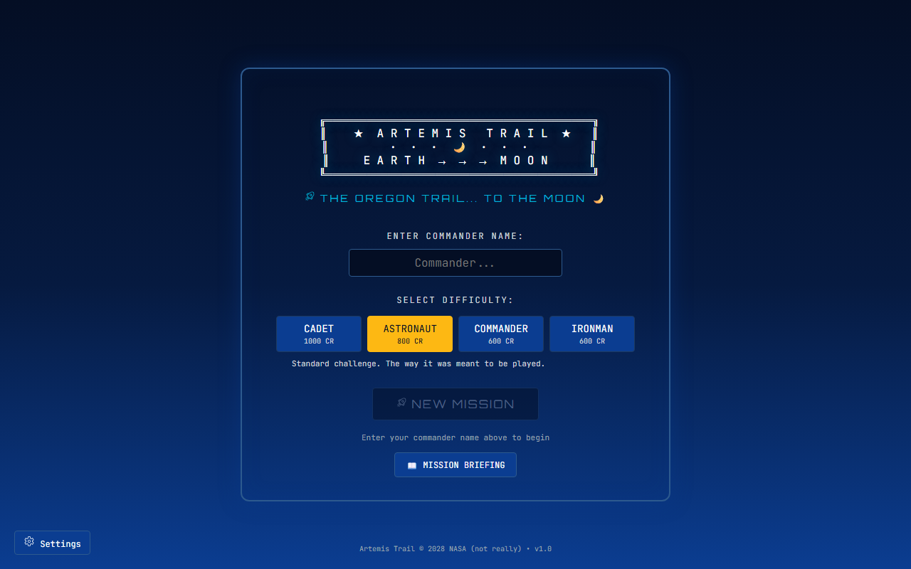
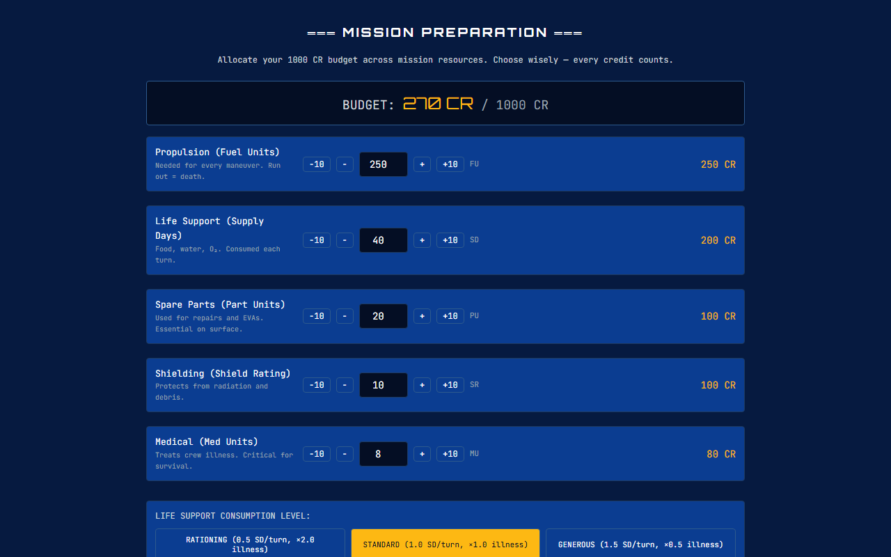
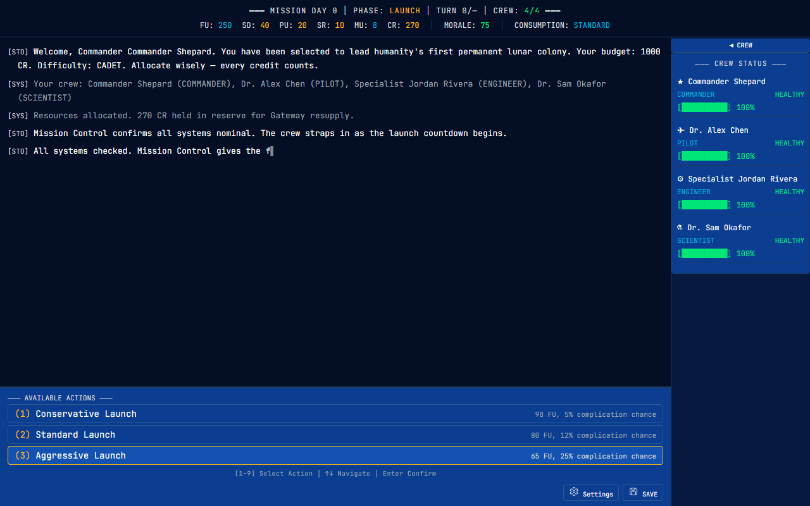
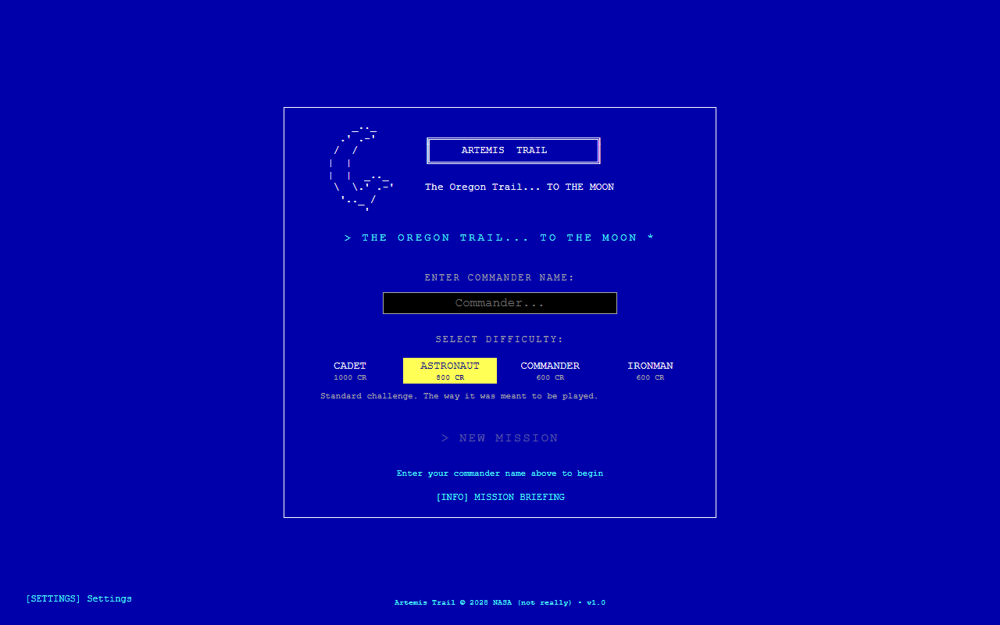
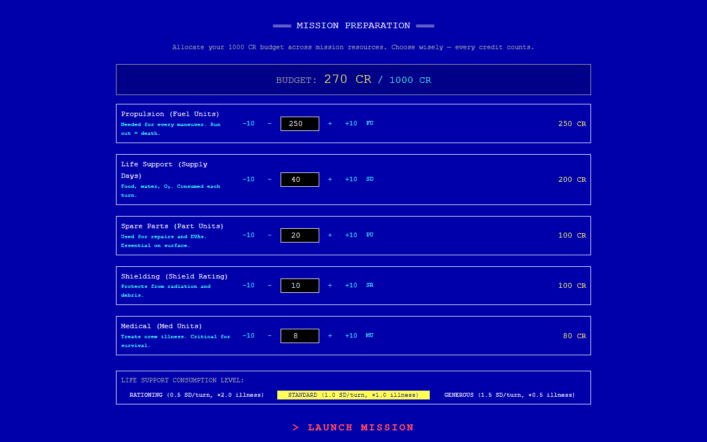
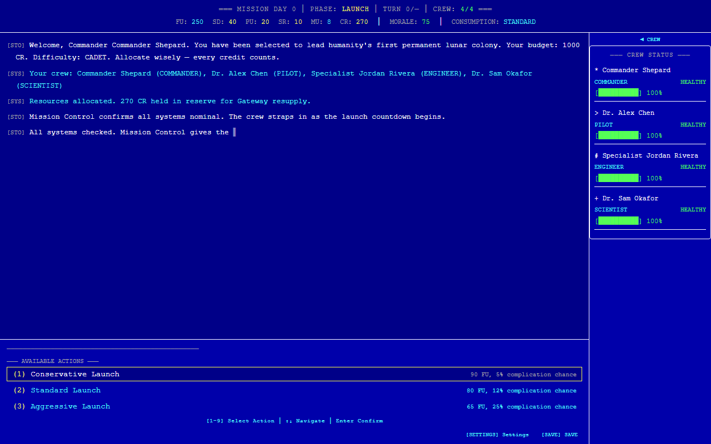

# 🚀 Artemis Trail

**The Oregon Trail... TO THE MOON** — A text-based adventure game where you command NASA's Artemis VII mission to establish humanity's first lunar colony.

Built entirely using **GitHub Copilot's agentic development** workflow with 15 specialized AI agents.

[](https://www.typescriptlang.org/)
[](https://react.dev/)
[](https://www.electronjs.org/)
[](https://playwright.dev/)

---

## 🎮 Play the Game

### Option 1: Desktop App (Windows / Mac / Linux)

Download the latest release for your platform:

| Platform | File | How to Run |
|----------|------|------------|
| **Windows** | `Artemis Trail 0.1.0.exe` | Double-click the `.exe` — it's a portable app, no installation needed |
| **macOS** | `Artemis Trail-0.1.0.dmg` | Open the `.dmg`, drag to Applications |
| **Linux** | `Artemis Trail-0.1.0.AppImage` | `chmod +x *.AppImage && ./Artemis\ Trail-0.1.0.AppImage` |

**Build desktop app from source:**
```bash
git clone https://github.com/johfirth/OregonTrail3000.git
cd OregonTrail3000
npm install
npx electron-vite build
npx electron-builder --win portable   # Windows .exe
npx electron-builder --mac            # macOS .dmg
npx electron-builder --linux          # Linux .AppImage
```

> **Note**: macOS builds require a Mac. Linux builds require Linux or Docker. Windows builds work on Windows. Use CI/CD (GitHub Actions) for cross-platform builds.

### Option 2: Docker Container (Any Platform)

Run the game in a Docker container — accessible via any web browser:

```bash
# Pull and run (or build from source)
git clone https://github.com/johfirth/OregonTrail3000.git
cd OregonTrail3000
npm install && npm run build:web
docker build -t artemis-trail .
docker run -d -p 8080:80 --name artemis-trail artemis-trail
```

Then open **http://localhost:8080** in your browser.

**Stop the container:**
```bash
docker stop artemis-trail && docker rm artemis-trail
```

### Option 3: Development Mode

```bash
git clone https://github.com/johfirth/OregonTrail3000.git
cd OregonTrail3000
npm install
npm run dev:web    # Browser at http://localhost:5173
# or
npm run dev        # Electron desktop app with hot reload
```

---

## 🌙 About the Game

Artemis Trail reimagines the classic Oregon Trail (1978) as a NASA Artemis lunar mission. You are the Mission Commander of Artemis VII — lead your crew of 4 specialists from Kennedy Space Center to the Moon's south pole and establish humanity's first permanent colony.

### Game Phases
1. **Mission Prep** — Allocate your budget across 6 resources (propulsion, life support, spare parts, shielding, medical, reserve budget)
2. **Launch** — Choose your launch profile (Conservative / Standard / Aggressive)
3. **Lunar Transit** — 3-day coast through cislunar space, managing random events
4. **Gateway Station** — Dock at the Lunar Gateway, resupply at premium prices, select your landing site
5. **Descent & Landing** — Powered descent to the lunar south pole
6. **Surface Operations** — EVAs for ice extraction, equipment repair, and science missions
7. **Colony Establishment** — Final scoring — did you build a thriving colony or barely survive?

### Features
- **6 resources** mapped from Oregon Trail: Propulsion (Oxen), Life Support (Food), Spare Parts (Ammo), Shielding (Clothing), Medical (Misc Supplies), Budget (Cash)
- **24 random events** with weighted probabilities — solar flares, micrometeorites, equipment failures, crew stress, and more
- **5 real Artemis landing sites** — Shackleton Rim, Nobile Valley, Malapert Summit, Haworth Basin, de Gerlache Ridge
- **4 crew specialists** — Pilot, Engineer, Scientist, Medical Officer — each with unique abilities
- **4 difficulty modes** — Cadet, Astronaut, Commander, Ironman
- **Oregon Trail-style death debrief** — "Would you like a Congressional hearing?"
- **Save/Load** — filesystem saves on desktop, localStorage in browser
- **NASA Mission Control aesthetic** — deep navy, NASA blue, red accents, gold data readouts

---

## 📸 Screenshots

### NASA Modern Theme
<p>
  
  
</p>
<p>
  
</p>

### Retro 80s Theme
<p>
  
  
</p>
<p>
  
</p>

---

## 🛠️ Tech Stack

| Layer | Technology |
|-------|-----------|
| **Language** | TypeScript (strict mode) |
| **UI Framework** | React 19 |
| **Desktop** | Electron 35 + electron-vite |
| **Packaging** | electron-builder (.exe, .dmg, .AppImage) |
| **Web Deploy** | Vite → Docker (nginx) |
| **Testing** | Playwright E2E (headed + headless), Vitest unit tests |
| **MCP** | @playwright/mcp for browser automation |
| **Content** | TypeScript data files (type-safe, validated) |

---

## 🤖 Built with Agentic Development

This entire project was designed and built using **GitHub Copilot's agentic development** workflow. 15 specialized AI agents collaborate through the `.github/agents/` directory, each with defined ownership boundaries, tools, and expertise.

### Agent Roster

| Agent | Role | Owns | Tools |
|-------|------|------|-------|
| 🎨 **Game Designer** | Game design documents | `game-design/` | file-operations, code-search |
| ⚙️ **Engine Developer** | Core game engine | `src/engine/` | file-ops, terminal, code-search, git, npm |
| 🔧 **Systems Developer** | Game systems | `src/systems/` | file-ops, terminal, code-search, git, npm |
| 📦 **Content Developer** | Game content data | `src/content/` | file-ops, terminal, code-search, git |
| 🖥️ **UI Developer** | React interface | `src/ui/` | file-ops, terminal, playwright, git, npm |
| 🏗️ **Infra Developer** | Build/deploy pipeline | `electron/`, configs | file-ops, terminal, git, npm, docker |
| 🔒 **Security Developer** | Security fixes only | Security-related files | file-ops, terminal, code-search, git, npm |
| 🧪 **QA: Gameplay** | Full game loop testing | `tests/e2e/gameplay*` | playwright, terminal, docker |
| 🧪 **QA: Events** | Event system testing | `tests/e2e/events*` | playwright, terminal, docker |
| 🧪 **QA: UI** | Screen/navigation testing | `tests/e2e/ui*` | playwright, terminal, docker |
| 🧪 **QA: Edge Cases** | Boundary/save testing | `tests/e2e/edge*` | playwright, terminal, docker |
| ♿ **QA: Accessibility** | WCAG 2.1 compliance | `tests/e2e/accessibility*` | playwright, axe-core, terminal, docker |
| 🔒 **QA: Security** | Vulnerability testing | `tests/e2e/security*` | playwright, terminal, code-search, docker |
| 📋 **PR Reviewer** | Code review & approval | Pull requests | code-search, terminal, git |
| 🎯 **QA: UX** | UX review & theming | `tests/e2e/ux*` | playwright, terminal, docker |

### Agent Collaboration Model
- **Game Designer** writes `.md` design documents in `game-design/` — never writes code
- **Developer agents** read from `game-design/` and implement in `src/`
- **Security Developer** fixes vulnerabilities only — never changes gameplay
- **QA agents** use Playwright MCP for live browser automation testing
- **PR Reviewer** reviews and approves pull requests before merge
- **Copilot Instructions** (`.github/copilot-instructions.md`) enforce delegation to specialized agents

### Skills & References
- **Oregon Trail Reference**: Original 1978 BASIC source code (public domain, Creative Computing magazine) — included in `.github/references/oregon-trail-original.bas`
- **Mechanics Analysis**: Annotated breakdown of all Oregon Trail game systems — `.github/references/oregon-trail-analysis.md`
- **Design Patterns**: Text adventure design patterns reference — `.github/references/text-adventure-design-patterns.md`
- **Playwright MCP**: Browser automation via `@playwright/mcp` — configured in `.vscode/mcp.json`
- **axe-core**: Automated WCAG accessibility auditing via `@axe-core/playwright`

---

## 📁 Project Structure

```
.github/
├── agents/              # 15 specialized AI agent definitions
│   ├── game-designer.agent.md
│   ├── game-engine-dev.agent.md
│   ├── game-systems-dev.agent.md
│   ├── game-content-dev.agent.md
│   ├── game-ui-dev.agent.md
│   ├── game-infra-dev.agent.md
│   ├── security-dev.agent.md
│   ├── qa-gameplay.agent.md
│   ├── qa-events.agent.md
│   ├── qa-ui.agent.md
│   ├── qa-edge-cases.agent.md
│   ├── qa-accessibility.agent.md
│   ├── qa-security.agent.md
│   ├── qa-pr-reviewer.agent.md
│   └── qa-ux.agent.md
├── instructions/        # Scoped Copilot instructions
├── references/          # Oregon Trail source + design patterns
└── copilot-instructions.md  # Repo-wide agent rules

electron/                # Electron desktop shell
├── main.ts              # Main process (window, IPC, auto-update)
└── preload.ts           # IPC bridge to renderer

src/
├── engine/              # Pure TS game engine (no DOM dependencies)
│   ├── types.ts         # All type definitions + game constants
│   ├── engine.ts        # GameEngine implementation (16+ commands)
│   ├── state.ts         # Game state factory
│   ├── phases.ts        # Phase transition controller
│   ├── turns.ts         # Turn processing loop
│   ├── events.ts        # Weighted event dispatcher
│   ├── rng.ts           # Seeded PRNG (deterministic)
│   └── save.ts          # Save/load with versioning
├── systems/             # 7 game systems
│   ├── resources.ts     # Resource consumption + depletion
│   ├── health.ts        # Crew health (5-tier) + morale
│   ├── eva.ts           # EVA missions + skill challenges
│   ├── trading.ts       # Gateway trading (1.5× markup)
│   ├── landing.ts       # Landing site selection + descent
│   ├── weather.ts       # Solar weather (Markov chain)
│   └── scoring.ts       # Victory scoring (S-F ratings)
├── content/             # Game content data
│   ├── events.ts        # 24 weighted events
│   ├── crew.ts          # 4 crew specialists
│   └── narrative.ts     # All narrative text + endings
├── ui/                  # React UI (NASA mission control aesthetic)
│   ├── screens/         # 7 game screens
│   ├── components/      # StatusBar, NarrativeLog, ActionMenu, CrewPanel
│   ├── hooks/           # useGameEngine hook
│   └── styles.ts        # NASA color palette + shared styles
└── platform/            # Platform abstraction (save manager)

tests/e2e/               # Playwright E2E tests
game-design/             # Game design documents (270+ KB)
├── lunar-colony-overview.md
├── world-design-lunar-mission.md
├── game-mechanics-mission.md
├── character-design-crew.md
├── event-system-space.md
├── narrative-outline-artemis.md
└── templates/           # Design document templates
```

---

## 🧪 Testing

### Run E2E Tests (Headed — visible browser)
```bash
# Start the game first (Docker or dev server)
docker run -d -p 8080:80 --name artemis-trail artemis-trail

# Run tests with visible browser
npx playwright test --project=headed

# Run tests headless (faster, for CI)
npx playwright test --project=headless
```

### Run Unit Tests
```bash
npm test
```

### Test Coverage
- **187 unit tests** (Vitest) covering engine, systems, and content
- **138 E2E tests** (Playwright) covering gameplay, accessibility, keyboard, security, retro theme, and UX
- **Total: 325 tests** across unit and E2E suites
- **Headed mode** with `slowMo: 300ms` so you can watch the game being played
- **Video recording** and screenshots captured for every test run
- **Traces** available for debugging: `npx playwright show-trace test-results/*/trace.zip`

#### Test Suites
| Suite | Tests | Focus |
|-------|-------|-------|
| Unit (Vitest) | 187 | Engine, systems, content validation |
| E2E: Gameplay | 10 | Full playthroughs, phase transitions, defeat paths |
| E2E: Accessibility | 10 | WCAG 2.1, axe-core, color contrast |
| E2E: Keyboard | 11 | Number keys, arrows, Enter, Escape, wrapping |
| E2E: Security | 7 | XSS, injection, localStorage, CSP |
| E2E: Retro Theme | 6 | Visual authenticity, a11y in retro mode |
| E2E: UX Review | 8 | Menu clarity, budget feedback, theme UX |
| E2E: UI & Other | 14 | Rendering, navigation, interactions, edge cases |
| E2E: Electron | 6 | Desktop app window, shortcuts, navigation |

---

## 📦 Build Commands

| Command | Output |
|---------|--------|
| `npm run dev` | Electron desktop app (dev mode + HMR) |
| `npm run dev:web` | Browser dev server (localhost:5173) |
| `npm run build:web` | Static web build → `dist/web/` |
| `npm run build:desktop` | Electron build + installers |
| `npm test` | Vitest unit tests |
| `npx playwright test` | Playwright E2E tests |
| `npm run docker:build` | Build Docker image |
| `npm run docker:run` | Run Docker container (port 8080) |

---

## 📜 History & Inspiration

The original Oregon Trail was created in 1971 by Don Rawitsch, Bill Heinemann, and Paul Dillenberger — three student teachers at Carleton College in Minnesota. The full BASIC source was published in the May–June 1978 issue of Creative Computing magazine and is now public domain.

Artemis Trail maps the Oregon Trail's proven game mechanics — zero-sum resource allocation, weighted random events, risk-reward decisions, and dark humor in failure — onto NASA's real Artemis program to return humans to the Moon.

## License

MIT
